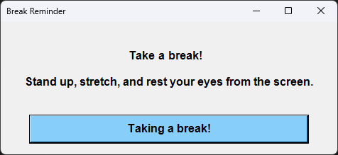

# Break Reminder

A lightweight application that displays reminder notifications prompting users to take regular breaks from their computer screen. It creates a popup window that reminds users to stand up, stretch, and rest their eyes from screen time, helping to prevent eye strain and physical discomfort associated with prolonged computer use.

✨ **Now with multi-language support and two interface options!** The application automatically detects your system language and displays messages accordingly.

## Screenshots



### Other Languages
The application supports 8 languages in total! See the Features section for the complete list.

## Features

- **Two interface options**:
  - PowerShell version with custom Windows Forms UI
  - VBScript version with simple message box (no visible console window)
- Simple, non-intrusive reminder popup
- Configurable message and appearance
- Easy to schedule with Windows Task Scheduler
- **Extensive language support** (8 languages):
  - English (en-US)
  - Russian (ru-RU)
  - French (fr-FR)
  - Spanish (es-ES)
  - German (de-DE)
  - Chinese (Simplified) (zh-CN)
  - Japanese (ja-JP)
  - Portuguese (Brazil) (pt-BR)
- Easily extensible with additional language translations
- Full Unicode support for all languages

## Requirements

- Windows operating system
- For PowerShell version: PowerShell 5.1 or higher
- For VBScript version: Windows Script Host (included in all Windows versions)
- No additional dependencies required

## Installation

### Easy Installation (Recommended)

1. Download the latest release from the [Releases page](https://github.com/av-mamzikov/break-reminder/releases)
2. Extract the ZIP file to any location
3. Double-click the `Install-BreakReminder.bat` file
4. Follow the on-screen instructions to:
   - Choose between PowerShell or VBScript version
   - Install the application to your user profile
   - Create an optional desktop shortcut
   - Set up automatic reminders at your preferred interval
   - Select your preferred language

### Manual Installation

1. Clone this repository or download the script file:
   ```
   git clone https://github.com/av-mamzikov/break-reminder.git
   ```
2. Ensure you have PowerShell 5.1 or higher installed

### PowerShell Execution Policy

By default, Windows restricts the execution of PowerShell scripts. You have several options to run the script:

#### Option 1: Temporary bypass for a single execution

```powershell
powershell -ExecutionPolicy Bypass -File "path\to\break-reminder.ps1"
```

#### Option 2: Change execution policy for your user account

Open PowerShell as Administrator and run:

```powershell
Set-ExecutionPolicy -ExecutionPolicy RemoteSigned -Scope CurrentUser
```

This allows you to run local scripts without signing, but requires downloaded scripts to be signed by a trusted publisher.

#### Option 3: Unblock the script file

Right-click the script file → Properties → Check the "Unblock" box → Apply

3. No additional installation is required.

## Usage

### Running manually

#### PowerShell version
1. Open PowerShell
2. Navigate to the directory containing the script
3. Run the script:
   ```powershell
   .\break-reminder.ps1
   ```

#### VBScript version
1. Double-click the `break-reminder.vbs` file
   or
2. Run from command line:
   ```cmd
   wscript.exe "path\to\break-reminder.vbs"
   ```

### Language Options

#### PowerShell version
```powershell
# Run with system language (default)
.\break-reminder.ps1

# Run with a specific language
.\break-reminder.ps1 -Language fr-FR
```

#### VBScript version
```cmd
# Run with system language (default)
wscript.exe "path\to\break-reminder.vbs"

# Run with a specific language
wscript.exe "path\to\break-reminder.vbs" fr-FR
```

### Setting up scheduled reminders

#### Using the installer (recommended)
The installer can set up scheduled tasks for you automatically with your preferred interval.

#### Manual setup
To set up reminders manually:

1. Open Task Scheduler (taskschd.msc)
2. Click "Create Basic Task"
3. Enter a name (e.g., "Screen Break Reminder") and description, then click Next
4. Set your desired trigger (e.g., Daily, or every X hours), then click Next
5. Select "Start a program" and click Next

##### For PowerShell version:
6. In Program/script field enter: `powershell.exe`
7. In Add arguments field enter: `-ExecutionPolicy Bypass -WindowStyle Hidden -File "C:\path\to\break-reminder.ps1"`

##### For VBScript version:
6. In Program/script field enter: `wscript.exe`
7. In Add arguments field enter: `"C:\path\to\break-reminder.vbs"`

8. Click Next, review the settings, and click Finish

## Customization

You can modify the script to change:
- The reminder message
- Window appearance and size
- Display duration
- Other visual elements

### Adding a New Language

1. Create a new XML file in the `localization` folder with the culture code as filename (e.g., `fr-FR.xml`)
2. Use this template:
   ```xml
   <?xml version="1.0" encoding="UTF-8"?>
   <resources>
     <string name="WindowTitle">Break Reminder</string>
     <string name="ReminderMessage">Take a break!

Stand up, stretch, and rest your eyes from the screen.</string>
     <string name="CloseButtonText">Taking a break!</string>
   </resources>
   ```
3. Translate the values to your target language
4. Make sure to save the file with UTF-8 encoding to ensure proper display of special characters

## License

[MIT License](LICENSE)

## Contributing

Contributions are welcome! Please feel free to submit a Pull Request.
